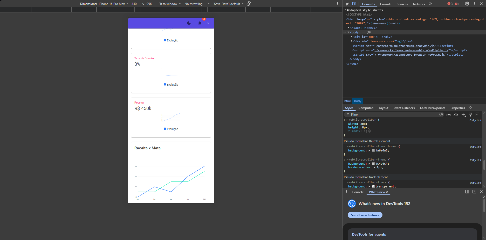
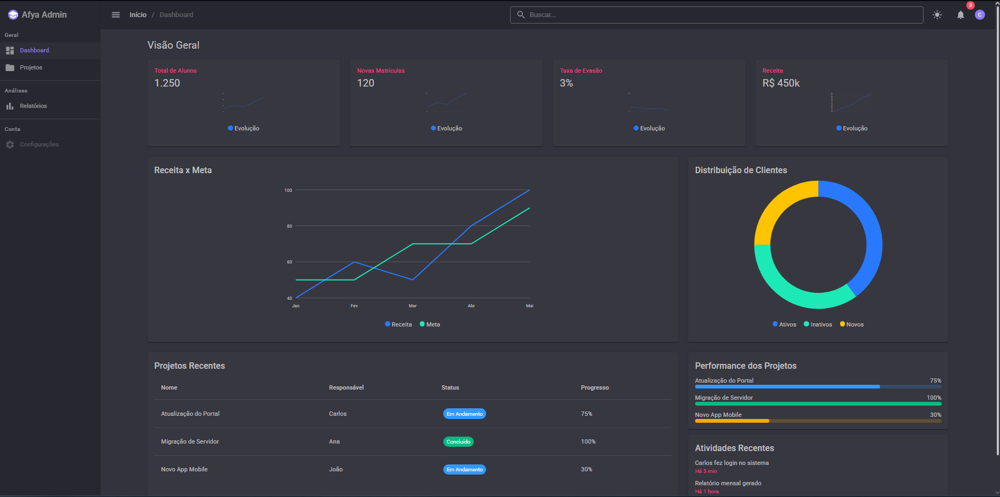
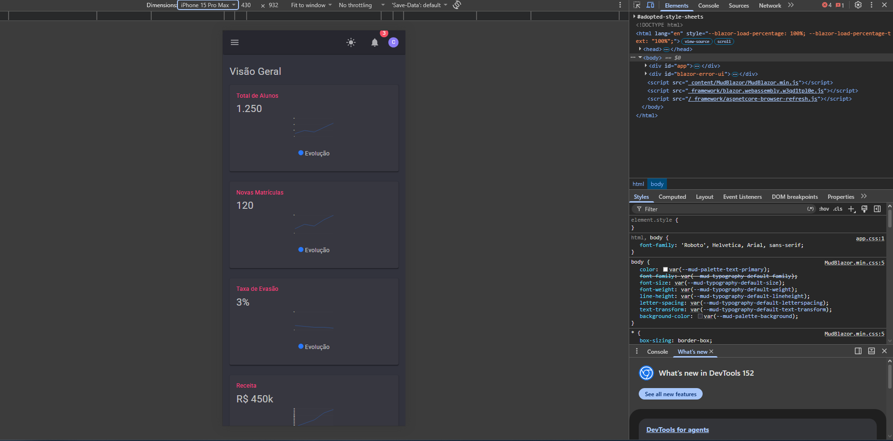
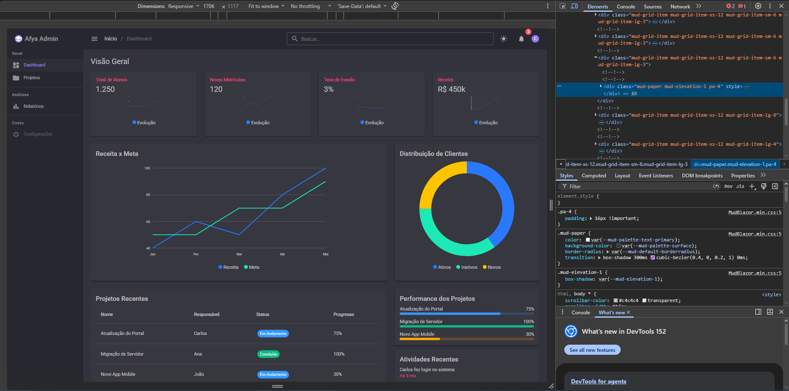

# Afya Admin — Dashboard com Blazor WebAssembly e MudBlazor

## Identificação

|                  |                                            |
| ---------------- | ------------------------------------------ |
| **Aluno(a)**     | Carlos Vitor (COMPLETAR com nome completo) |
| **Matrícula**    | COMPLETAR                                  |
| **Faculdade**    | Centro Universitário São Lucas             |
| **Curso**        | Ciência da Computação                      |
| **Disciplina**   | COMPLETAR                                  |
| **Professor(a)** | COMPLETAR                                  |
| **Semestre**     | 2026.2                                     |

## Objetivo do projeto

<!-- ESCREVA COM SUAS PALAVRAS (2 a 4 parágrafos): o que é o projeto, para que serve a plataforma fictícia "Afya Pedagógico", o que a página mostra (KPIs, gráficos, tabela, atividades) e por que os dados são fictícios. -->

## Tecnologias utilizadas

- .NET 10 / Blazor WebAssembly
- MudBlazor 9
- Git e GitHub para versionamento
- Visual Studio Code

## Como executar

Requisito: **.NET SDK 10**.

```bash
git clone https://github.com/SEU-USUARIO/afya-admin.git
cd afya-admin
dotnet watch
```

A aplicação abre em `http://localhost:5137`.

## Telas

### Tema claro



### Tema escuro



### Versão mobile



### HTML gerado (DevTools)



<!-- ESCREVA o que o print mostra: qual componente você inspecionou (ex.: card de KPI), qual tag HTML o Blazor gerou, quais classes apareceram (mud-paper, mud-elevation-1, pa-4...) e como o Class="pa-4" que você escreveu no código aparece no HTML final. -->

## Estrutura do projeto

```
afya-admin/
├── Components/
│   ├── AtividadesRecentes.razor
│   ├── DashboardCard.razor
│   ├── KpiCard.razor
│   ├── PerformanceProjetos.razor
│   └── TabelaProjetos.razor
├── Data/
│   └── FakeData.cs
├── Layout/
│   ├── MainLayout.razor
│   └── NavMenu.razor
├── Pages/
│   ├── Dashboard.razor
│   ├── NotFound.razor
│   ├── Projetos.razor
│   └── Relatórios.razor
├── Properties/
│   └── launchSettings.json
├── docs/
│   └── prints/
├── wwwroot/
│   ├── css/app.css
│   ├── favicon.png
│   ├── icon-192.png
│   └── index.html
├── _Imports.razor
├── App.razor
├── Program.cs
└── afya-admin.csproj
```

- **`Components/`**: componentes visuais reutilizáveis que a página monta.
- **`Data/`**: dados fictícios e modelos (`Kpi`, `Projeto`, `Atividade`), separados da interface.
- **`Layout/`**: estrutura da aplicação (sidebar, barra superior, menu e tema).
- **`Pages/`**: páginas com rota (`@page`), como o Dashboard.
- **`wwwroot/`**: arquivos estáticos e o `index.html` que carrega o Blazor.

## Componentes criados

| Componente            | Responsabilidade                                          | Parâmetros que recebe                     |
| --------------------- | --------------------------------------------------------- | ----------------------------------------- |
| `DashboardCard`       | Card genérico com título que envolve qualquer conteúdo    | `Titulo`, `ChildContent` (RenderFragment) |
| `KpiCard`             | Mostra um indicador com valor e mini gráfico de tendência | `Titulo`, `Valor`, `Cor`, `DadosGrafico`  |
| `TabelaProjetos`      | Tabela de projetos recentes com status                    | `Projetos`                                |
| `PerformanceProjetos` | Lista de projetos com barras de progresso                 | `Projetos`                                |
| `AtividadesRecentes`  | Feed de atividades recentes                               | `Atividades`                              |

## O que aprendi

<!-- RESPONDA COM SUAS PRÓPRIAS PALAVRAS, citando o SEU projeto (um parágrafo curto por pergunta). Respostas genéricas ou copiadas zeram o critério. -->

**1. Como uma aplicação Blazor WebAssembly inicia no navegador? Qual é o papel do `index.html`, da `<div id="app">` e do `Program.cs`?**

(sua resposta)

**2. Qual é a diferença entre um Layout, uma Page e um Component neste projeto? Dê um exemplo de cada.**

(sua resposta)

**3. O que é um `RenderFragment` e como o `DashboardCard` usa esse recurso para ser reutilizado por vários cards?**

(sua resposta)

**4. Como funciona o `@bind-Valor` no `SeletorPeriodo`? Qual é o papel do `ValorChanged`?**

(sua resposta)

**5. Por que os dados ficam na pasta `Data`, separados dos componentes? Que vantagem isso traz se, no futuro, os dados vierem de uma API?**

(sua resposta)

**6. Como o `MudGrid` com `xs`, `sm` e `lg` faz os cards de KPI se reorganizarem em telas de tamanhos diferentes?**

(sua resposta)

**7. Como foi possível estilizar a página inteira sem escrever CSS? Explique o papel do tema (`MudTheme`) e das classes utilitárias.**

(sua resposta)

**8. Por que o namespace do projeto é `afya_admin` e não `afya-admin`?**

(sua resposta)

## Dificuldades e soluções

<!-- Descreva pelo menos DOIS problemas reais que você enfrentou e como resolveu cada um, com suas palavras. -->

**Dificuldade 1:** (descreva o problema)

**Solução:** (como resolveu)

**Dificuldade 2:** (descreva o problema)

**Solução:** (como resolveu)

## Melhorias futuras (opcional)

<!-- O que você implementaria a seguir? -->
